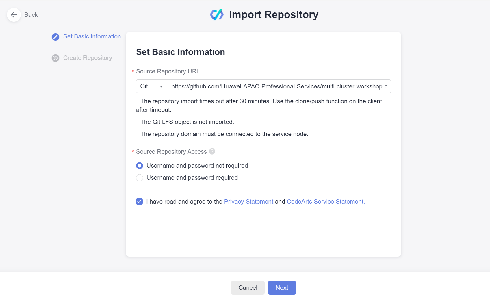
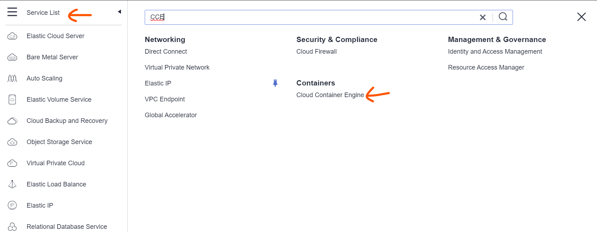
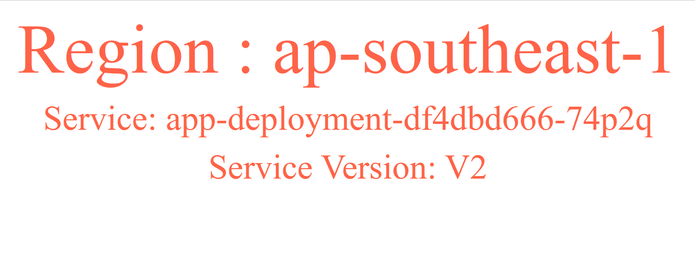

# Multi-Cloud Infrastructure and Application Management Workshop
This workshop demonstrates how to manage multi-cloud infrastructure with the using of three Huawei Cloud regions to simulate the multi-cloud.

All the underlying infrastructures are managed by [`infra`](./infra/) module. For application management, [Argo CD](https://argo-cd.readthedocs.io/) is deployed by [Kubernetes](./kubernetes/) module to fulfil this purpose.


# Goals
* Learn basic GitOps concept
* Learn Terraform beyond Infrastructure as Code
* Build a multi-cluster management solution
* Explore the traffic distribution policies 

# Target audience
This is a technical workshop using three CCE cluster to simulate the situation where customers have multiple Kubernetes clusters on different cloud platform or on-premises. The participants should have experiences with Huawei Cloud and have basic knowledge of Kubernetes.

# Prerequisites

1. A Huawei Cloud Account
2. `kubectl`, `git` and `terraform` command tools have been installed on your laptop

# Workshop Hands-on Environment


# Tasks

## Create Projects and CCE agency
1. Log in to [Huawei Cloud](https://www.huaweicloud.com/intl/en-us/) with provided credential, Click `Service List` on the left upper corner of the page and Search `IAM`, then select `Identity and Access Management` service


2. On the `IAM` service page, Select `Projects` on the left side pannel to check if `ap-southeast-1`,`ap-southeast-2`,`ap-southeast-3` exists.


3. If required projects don't exist, Click `Create Project` on the upper right corner of the page to create project, you only need to select the `Region` in which the project is missing, the system will create the default project automatically, you don't need to click `OK` or provide any input


4. Click `Service List` on the left upper corner of the page and Search `CCE`, then select `Cloud Container Engine` service


5. If you are prompted to create the agency for CCE, just click `OK` to authorize the system to create the necessary agencies on behalf of you. Changing the region to make sure the necessary agencies in the three regions(`ap-southeast-1`,`ap-southeast-2`,`ap-southeast-3`) are in place now.


## Create Access Keys
1. Log in to [Huawei Cloud](https://www.huaweicloud.com/intl/en-us/) with provided credential
2. Click account name on the upper right corner of the console, and choose `My Credentials`

3. Choose `Access Keys` on the left panel of the console and Click `Create Access Key`

4. Save the credential safely on your laptop

## Environment Variables Setup
Before running terraform to create resources on Huawei Cloud, you need to setup credential provider for Terraform, hard-coded credential with Terraform is not recommended, we encourage you to provide credential through environment variables.

Depending on what kind of operating system you are using, You can choose one of the following methods to configure environment variables on your laptop for Terraform.

Get the credential from [Create Access Keys](#create-access-keys) task.

### Linux/MacOS

```
export HW_ACCESS_KEY="anaccesskey"
export HW_SECRET_KEY="asecretkey"
export HW_REGION_NAME="ap-southeast-3"
```

### Windows CMD
```
setx HW_ACCESS_KEY "anaccesskey"
setx HW_SECRET_KEY "asecretkey"
setx HW_REGION_NAME "ap-southeast-3"
```

### Windows Powershell
```
$Env:HW_ACCESS_KEY="anaccesskey"
$Env:HW_SECRET_KEY="asecretkey"
$Env:HW_REGION_NAME="ap-southeast-3"
```

## Apply Terraform Configuration
1. Execute the following command to clone `multi-cluster-workshop` repository to your laptop
```
git clone https://github.com/Huawei-APAC-Professional-Services/multi-cluster-workshop.git
```

2. Change directory to `multi-cluster-workshop/infra`
3. Apply Terraform Configuration  

:bulb: Local state file is used for this Terraform configuration, but you can change it to remote state as well.

```
terraform init
terraform apply
```
Wait for the Terraform to finish, a total of three CCE clusters will be created in Singapore, Hong Kong and Bangkok regions. Cluster `fleetmanager` is the cluster in which all the management tools wil be deployed. Cluster `cluster-a` and `cluster-b` are the clusters in which business application will be deployed. 

## Deploy ArgoCD into `fleetmanager` cluster
1. Change directory to `multi-cluster-workshop/kubernetes`
2. Apply Terraform Configuration

:bulb: Local state file is used for this Terraform configuration, and it needs to access the state file for `Infra` module. 

```
terraform init
terraform apply
```

3. Wait for the terraform to finish, and you can use the output value `argcd_url`(address for Argocd Web) and `argocd_password`(password for `admin` user)

:bulb: You may run into the following error when you are applying the Terraform configuration, Please execute ```terraform apply``` agin.


4. Open your local browser to access Argocd to check if deployment is successful


You should be able to login to the Argocd without any errors and there is no applications are configured


## Create CodeArts Repository
1. Log in to [Huawei Cloud](https://www.huaweicloud.com/intl/en-us/) with provided credential, Click `Service List` on the left upper corner of the page and Search `codearts`, then select `CodeArts Repo` service


2. If your account has not tried `CodeArts` before, You will be prompted to purchase the service like the following picture shows(go to steps 5 otherwise), Please select `Basic Edition` and Click `Try free`


3. On the purchase page, click `Next` directly, no need to change any parameters

4. On the new page, Click `Pay` button to finish purchase


:bulb: You may need to wait a few minutes before the purchase takes effect. 

5. On the `CodeArts Repo` page, Click `Access Service` button to access `CodeArts` service


6. On the new page, Click `HomePage` on the top pannel, if there is no any existing project, Click `Create Project` on the right upper corner of the page
. 

7. if there is existing project, you can skip this step and next step. On the `Create Project` page, click `New` to start creating a project


8. on the project information page, provde a `Project Name` and then click `OK`


9. On the project page, Select `Repo`-->`Code` on the left side pannel


10. On the `Repo` page, Click the drop down menu icon after `+New Repository` button and Select `Import Repository`


11. On the `Import Repository` page, provide ```https://github.com/Huawei-APAC-Professional-Services/multi-cluster-workshop-demo-app.git``` as `Source Repository URL` parameter and check the checkbox for the service agreement. you can leave other parameters as default and click `Next`


12. On the new page, provide `demo` as the value of `Repository Name` and leave other parameters as default and click `OK` to create the repo


13. On the upper right corner of the page, Clicke `Hi` icon and Select `This Account Settings`


14. On the left side pannel of the new page, Select `Repo` --> `HTTPS Password` and Copy `Username`


## Create Application Deployment
1. Change directory to `multi-cluster-workshop/kubernetes`
2. Open the `application.tf` with your local tex editor
3. uncomment all lines in the file
4. Locate 14th and 15th line of the file and change the value for `"username"` to the value you copied in steps 14 of [Create CodeArts Repository](#create-codearts-repository) and `password` to your account password
5. Locate 13th and 53th line of the file and change the value for `"url"` to your repo's HTTPS endpoint, You can find the endpoint from the repo page as the following picture shows


6. Apply Terraform Configuration
```
terraform apply
```

## Verify Application Deployment
1. Log in to ArgoCD web page again with address and credentials for `admin` user generated at [Deploy ArgoCD into `fleetmanager` cluster](#deploy-argocd-into-fleetmanager-cluster)
2. On the ArgoCD web page, You should able to see two application and its status is `Healthy` and `Synced`


## Verify Application
1. On Huawei Cloud console and select `Hong Kong` and `Bangkok` region respectively, Click the `Service List` and Search ```CCE```, go to `Cloud Container Engine` by Clicking the `Cloud Container Engine` under `Containers` label


2. On `Cloud Container Engine` page, Click `cluster-a`


3. On the `cluster-a` detail page, Select `Networking` --> `Ingresses` under `webapp` namespace, you can find the public ip address of the application under `Forwarding Policy` tab


4. Open a browser tab to access the application with the ip address you got from last step, Please note only http is supported. You should be able to see the following page if the application is running appropriately.


## Change Application Version
1. Go back to `CodeArts Repo` service and Select the `demo` repository

2. Open the `base/web.yaml` file on the console and Select `Edit` from the upper right corner of the editor


3. Locate the 57th line of the file to change the `Value` to `V2` and provide a `Commit Message`, then Click `OK` to save the changes


4. Go back to Argocd Web page and select any one of the two applications to check if the application deployment is updated. if your application is updated, you should see the same comment that you provided during the code changes under the `LAST SYNC` tab. If you don't see the same comment, you can manually synchronization the deployment by clicking `SYNC` on the page or wait for a few minutes


5. When you refresh the application page again, you should observe the changes


# Clean up
1. Change directory to `multi-cluster-workshop/kubernetes`
2. Execute the following command to destroy the environment
```
terraform destroy
```
3. Change directory to `multi-cluster-workshop/infra`
2. Execute the following command to destroy the environment
```
terraform destroy
```